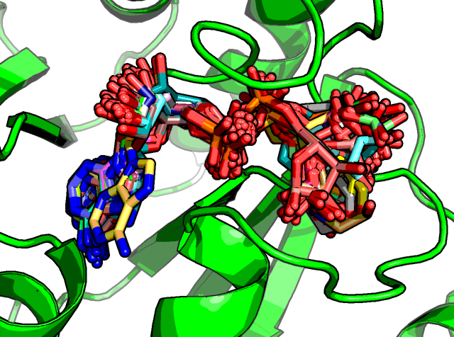

# NSP3-macrodomain
Data for the SARS-COV-2 NSP3-macrodomain Fragmenstein run for Diamond/SGC-UoOx and UCSF.

> For results see: [Michelanglo](https://michelanglo.sgc.ox.ac.uk)
> For more see [Fragalysis](https://fragalysis.diamond.ac.uk/viewer/react/preview/target/mArh)

Pairwise permutations of Diamond and UCSF structures only, ribo-ADP is absent (_vide_ _infra_).

Of the 49,506 permutations, 21,059 were successful.

* These were whole hits, not decomposed —this was tried, but results in mostly linked fragments, which I am told is boring.
* A new field is present in the table `N_`

The settings were

## Ribo-ADP
The native product is present in several structures. 

This was not used as it is already a 400 dalton molecule and is repeated multiple times.
When decomposed the phosphate groups give really strong ∆∆G, which is annoying as they are not at all drug-like.
The two riboses and the nucleobase in particular, is but that would require manual input, which I did not get round to doing.
